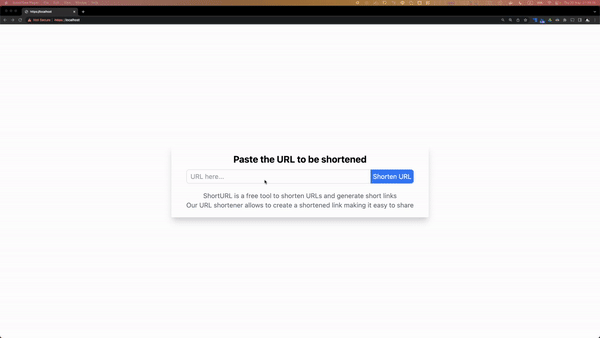

# Short-Url

Yet another short-url website clone. This mini project was build in order to, at least, proven that I can code.
## Demo



## Tech Stack

**Client:** Nextjs, TailwindCSS

**Server:** Nginx, Gin, MongoDB

**Deployment:** Docker, Github Action, Kustomize, ArgoCD


## Run Locally (with `docker compose`)

#### Prerequisite
- Docker and Docker compose

Clone the project

```bash
  git clone --recurse-submodules https://github.com/kofeebrian/short-url-frontend.git short-url
```

Go to the project directory

```bash
  cd short-url
```

Config `.env.local`, for example

```ini
  NEXT_PUBLIC_API_ENDPOINT=http://localhost:8080/api # no tail `/`
```

Another file needed to config is `server/.env`, which they need to be matched
```ini
  MONGO_URI=mongodb://db:27017        # mongodb uri
  SERVER_NAME=http://localhost:8080   # backend endpoint
  SECRET_KEY=secret                   # JWT secret
```

Start the project

*You might need to build first

```bash
  # docker compose build
  docker compose up -d
```

*Nextjs project embedded environment variables during build time, therefore image need to be rebuild every time we change environment variables.


## Environment Variables

To run this project, you will need to add the following environment variables to your .env file

**server/.env** - backend variables

- `MONGO_URI` - mongodb uri for connecting to the mongo database

- `SERVER_NAME` - the server will use this variable to concat with hash and form the short-url, so this must point to server endpoint (usaully the same one as `NEXT_PUBLIC_API_ENDPOINT` without `/api`)

- `SECRET_KEY` - secret for JWT, which I uses for authentication to use shorten service

**./env.local**

- `NEXT_PUBLIC_API_ENDPOINT` - backend endpoint with `/api` 


## Lessons Learned

This section would be long since I'm doing for learning anyway.

#### TL;DR
- Use time to find solutions, rather than how it function
- However, knowing the tools, frameworks is also crucial (or wasting more time)
- So-called simple app, might not be a walk in the park when come to practical system design
- Next.js hard coded ENV VAR in build phase, impossible for (simple) dynamic ENV VAR
    - app props (no secret), or script to replace vars
- MongoDB doesn't provides docker image for rasp pi

### Why I did this

Since I have not done anything related to web development for quite a while and I kind of need to find a job any time soon, I so want to brush up and back to learn about it again (to find a job, obviously). To be honest, in the past, I usually learnt but not got my hands dirty (as someone know as tutorial hell) but this time, I want to make it right by trying watching tutorial as less as possible. However, this project size is so tiny that there might not be much things to learn from, anyway I will to pull some.

### Short Url Website
I literally don't know why it came to this feature. I thought I found it on something like *10 projects for frontend developer* and I chosed this one due to its simplicity. However, I just knew that this problem's quite a popular interview question (in the old day, I guess) for a system design. According to GeekforGeek Website's article, interviewee has been asked to design in order to handle a million of the comming requests and records needed to be kept in database. From what I said, I realised that a so-called simple website can be this hard when come to system design for a hafty number of users.

### Website Design & Development
Obviously, the design is actually as simple AF, like easy to understand. Despite that, I spent most time learning how to use the frameworks, I meant all of them... However, once I got it, they became easier. Because I'm personally a kind of person who want to know deep (but lack of foundations), I couldn't help myself to dig too deep and wasted time playing around. What I've learnt would be that sometime, what we want just an solution to do things, not how things work.

### Technicals
No pain, no gain. No problems, no improvement. Even though the project seems simple, there are some problems during development not different from the other projects. I will list what I could think of here...

### Development Phase
At start, since I don't have to start it over as I have some backgroud of web development (especially frontend), what I did is learning frameworks which is currently a much new version compared to the one I used to use. As I mentioned, I read how it's changed rather than how to do what I want. I found about Next.js that

- Now it can make not only SSR, but also SSG, and CSR
- Next.js 13 is changed ultimatly (in the good way), especially how it handle layouts, loading and erros pages. I personally think it's sorta intutive.
- New features, like server components are what that I still couldn't wrap my head around yet because I didn't use them any

Switch to backend, I did go with Go so I chosed Gin. Why? Why not? it's popular, isn't it? No more JS, frontend's enough. However, that's why I spent more time learn to write go (but I thought I haven't use any `chan` of go yet tho...). Gin is one thing, but another thing is MongoDB. Luckily, I just learn how use them for only what I want. Having said that, query in MongoDB looks not that complicated, I reckon. **I learnt Gin and MongoDB for Go.**

- Gin, since it's been developed for so long (production read level?), it comes with tools, plugins to provide developers a good dev experiences.
- Gorm, I think, it doesn't support MongoDB. No problem, MongoDB did provide their mongodb-driver which simply enough once I learnt about Mongo query. They resemble each other.
- Account to my friends, Go literally provides everything but people have to write a lot things manually, so it's pain in the ___.

Nonetheless, hardly Next.js features did I use in this project since there's no needs. Even if SSR also do the job, I, however, didn't want to complicate it up, did I...?

### Deployment Phase
Rarely seen ones who deploy their apps without using containers these day. So do I. I used docker compose during local development and deployment. But, this time I want to take the scenic route by deploy using Kubernetes. I did have some basic k8s knowledge, thanks me during internship. Nothing's fancy, I planned to use my Rasp Pi 4 as a target cluster with k3d, which I think is the the most no brained way to create one so far, compared to what I'd gone through back then. Other tools I used are

- k3d == k3s but with docker where k3s is a light-weight k8s cluster. k3d uses each container as a node and loadbalances. Moreover, it comes with Ingress (traefik), CoreDNS, Metrics Server out of the box which is nice.
- Kustomize, which I learnt recently. It's for customise resources files similarly to Helm but there's only just files needed. (If I remember correct, helm, which I tried using it back then, is more like a registry of config files).
- Sealed Secret, GitOps tools to encrpyt secrets so we can push them into Github repo
- ArgoCD, a famous GitOps tool, to watch and auto sync resouce in the cluster. It comes with great Admin Management UI.

The plan is to use Github Action to build and push images and then update kubernetes configs so ArgoCD could sync those configs. That's all. I didn't do that all due to the time.

What I also want to make it happen is to monitor cluster with prometheus and grafana, as well as RBAC aithorization, Certificate Management, and Multi-Environments which, I think, are crucial for deploying apps in k8s cluster. I didn't make it because it will take too much time learning them all. I, however, hope I can use them someday.

By the way, there're some problems and solutions I learnt from trying to deploy this project to k3d cluster

#### Secrets with GitOps (ArgoCD)
Secret, even if it's hashed or not, should never exist in the github repo no matter what. So I researched how to address this issue. There's bunch of solutions but the one I chosed is [SealedSecret](https://github.com/bitnami-labs/sealed-secrets), which needs some setups however, basically it encrpyt secrets with its key generate by sealedsecret-controller deployed in the cluster, then decrpyt later. So, we push these encrpyted secrets into github repo instead. Solved. right?

#### Next.js when it comes to an image
I uses *environment variables* in Next.js to point at the api endpoint as every applications would do, however; Next.js causes a big problem about this.
Since API Endpoint isn't a secret (right?) so it can be exposed to the client side. So, I did.
```ini
# /.env.local
NEXT_PUBLIC_API_ENDPOINT=${API_ENDPOINT}
```
where `API_ENDPOINT` is local a env var. Due to during development, it loads (probably) those values every time it reload, therefore I couldn't find out that [Next.js basically embedded these variables into app (hard coded) when it build](https://nextjs.org/docs/app/building-your-application/configuring/environment-variables), usaully occur in the image building process. This makes app can't dynamically load env vars anymore. 

After did some researchs, ways to fix are basically, either bind to app's props or write a script to replace vars when start a container. The first way is usable when there's no sensitive values used, while the later way is kinda hacky but make sense. By doing neither of the above options, the only I could think of is the build image for specific deploy environments yet, Seem so impratical to me.

I guess this is why they encourage using Vercel (or the other similar options s.a. Netlify etc) as a place to deploy Next.js app as it build every time the app deploy. Because of this reason, I, then, didn't deploy frontend into the k8s cluster at all. Doable but such a pain.

#### MongoDB is not encouraged deploying as a Docker container on Rasp Pi 4
After I test on k3d on my PC, it seemed to work fine. But, as soon as I moved to my rasp pi 4. mongo pod seemed to suffer with Backoff error and the logs said something meaning this

```bash
WARNING: MongoDB requires ARMv8.2-A or higher, and your current system does not appear to implement any of the common features for that! applies to all versions ≥5.0, any of 4.4 ≥4.4.19, and any of 4.2 ≥4.2.19
```

Even though it's just a warning but I believe it's the problem because I think Pi use ARM64/v7 processor plus, it works fine on my Mac M1. Unfortunatly, there's no official mongo images for rasp pi which seems to too limited resourced for running mongodb in the container.

## Appendix

Special Thanks for ChatGPT. Without you, things would be much harder...
## License

[MIT](https://choosealicense.com/licenses/mit/)

